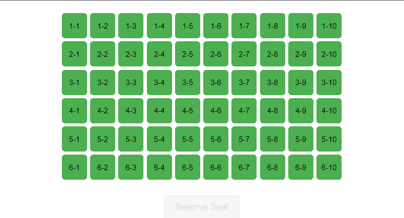
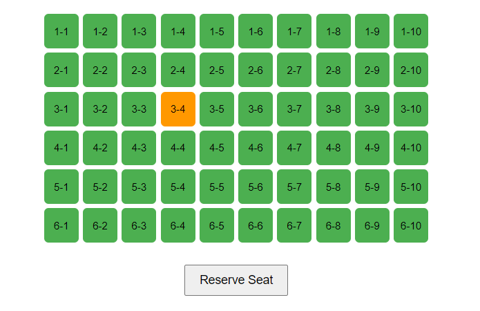
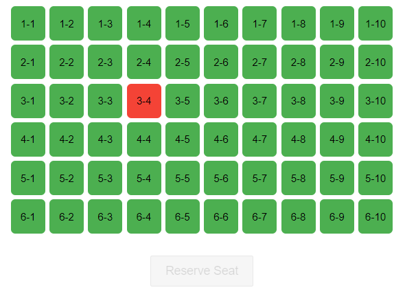
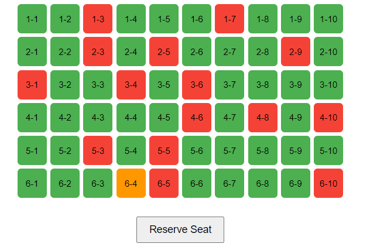
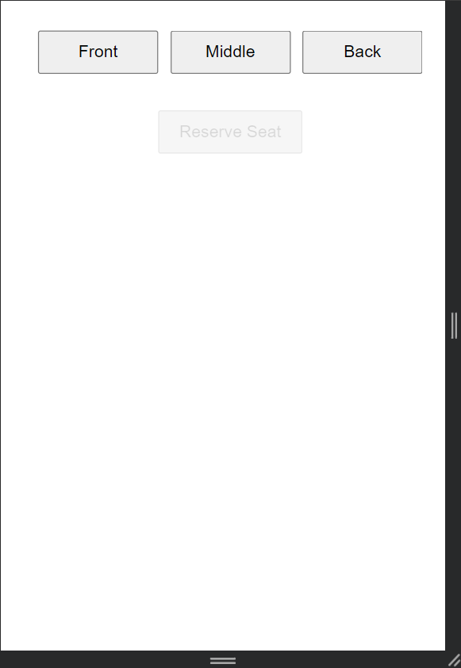
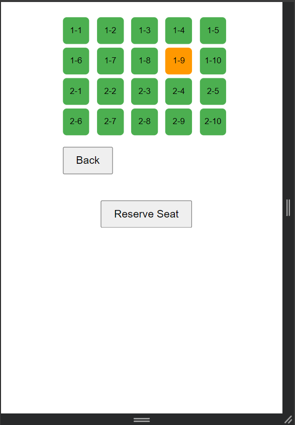
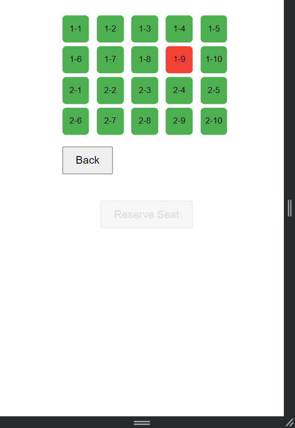

# 🎭 Responsive Theater Seat Selector

A modern, responsive web application for selecting theater seats with an intuitive interface that adapts to different screen sizes. Built with vanilla HTML, CSS, and JavaScript.

## 📋 Table of Contents

- [Features](#features)
- [Demo](#demo)
- [Installation](#installation)
- [Usage](#usage)
- [Project Structure](#project-structure)
- [Technical Details](#technical-details)
- [Responsive Design](#responsive-design)
- [Contributing](#contributing)
- [License](#license)

## ✨ Features

- **Interactive Seat Selection**: Click to select available seats
- **Real-time Status Updates**: Visual feedback for seat availability
- **Responsive Design**: Optimized for desktop and mobile devices
- **Area-based Navigation**: Mobile-friendly area selection (Front, Middle, Back)
- **Seat Reservation**: Reserve selected seats with confirmation
- **Clean UI**: Modern, intuitive interface with color-coded seat states

## 🎬 Demo

### Desktop View

*Full seat map view on desktop devices - 6x10 seat grid with color-coded availability*

### Seat Status Examples

*A seat in selected state (orange) ready for reservation*


*Multiple seats in reserved state (red) - no longer available*


*Combination of available (green), selected (orange), and reserved (red) seats*

### Mobile View - Area Selection

*Area selection interface on mobile devices - Front, Middle, Back navigation*

### Mobile Seat Status

*Mobile view showing a selected seat in orange*


*Mobile view showing reserved seats in red*


## 🚀 Quick Start

**Direct Browser Opening**
```bash
# Simply double-click index.html or drag it into your browser
```
## 📦 Installation

1. **Clone the repository**
   ```bash
   git clone https://github.com/MHMD304/Responsive-seat-selector.git
   cd Responsive-seat-selector
   ```

2. **Open the application**
   - Simply open `index.html` in your web browser

## 📱 Usage

### Desktop Experience
1. **View the seat map**: All 60 seats (6 rows × 10 columns) are displayed in a grid
2. **Select a seat**: Click on any green (available) seat to select it
3. **Reserve the seat**: Click the "Reserve Seat" button to confirm your selection
4. **Visual feedback**: 
   - 🟢 Green: Available seats
   - 🟠 Orange: Currently selected seat
   - 🔴 Red: Reserved seats

### Mobile Experience
1. **Choose an area**: Select from Front, Middle, or Back sections
2. **View area seats**: See detailed seat layout for your chosen area
3. **Select and reserve**: Same process as desktop
4. **Navigate back**: Use the "Back" button to return to area selection

### Testing Different States (For Screenshots)

#### To Show Available Seats
- Simply load the page - all seats will be green

#### To Show Selected Seat
- Click any available seat → it turns orange
- The "Reserve Seat" button becomes enabled

#### To Show Reserved Seats
- Select a seat (click it) → turns orange
- Click "Reserve Seat" button → turns red
- Repeat for multiple seats

#### To Show Mixed States
- Reserve several seats (5-8 recommended)
- Select one more seat (orange)
- Leave others available (green)

#### To Show Button States
- **Disabled**: No seat selected (default state)
- **Enabled**: After selecting any seat

## 📁 Project Structure

```
Responsive-seat-selector/
├── index.html          # Main HTML file
├── style.css           # Stylesheet with responsive design
├── script.js           # JavaScript functionality
└── README.md           # This documentation
```

### File Descriptions

- **`index.html`**: Clean HTML structure with semantic elements
- **`style.css`**: Responsive CSS with mobile-first approach
- **`script.js`**: Core functionality including seat generation, selection, and responsive layout

## 🔧 Technical Details

### Seat Configuration
- **Layout**: 6 rows × 10 columns = 60 total seats
- **Seat IDs**: Format `R{row}C{column}` (e.g., R1C1, R2C5)
- **Status States**: 
  - `available`: Ready for selection
  - `selected`: Currently highlighted
  - `reserved`: No longer available

### Key Functions

#### `renderSeats(map)`
Renders the complete seat grid for desktop view.

#### `renderMobileAreas(map)`
Creates area selection buttons for mobile devices.

#### `renderAreaDetail(area)`
Shows detailed seat layout for a specific area on mobile.

#### `renderLayout()`
Determines the appropriate layout based on screen size.

### Event Handling
- **Click Events**: Seat selection and reservation
- **Resize Events**: Automatic layout switching
- **Button States**: Dynamic enable/disable based on selection

## 📱 Responsive Design

### Breakpoints
- **Desktop**: > 600px - Full seat grid display
- **Mobile**: ≤ 600px - Area-based navigation

### Mobile Optimizations
- **Touch-friendly**: Larger touch targets
- **Simplified navigation**: Area-based selection
- **Reduced complexity**: Focused view for better UX
- **Responsive sizing**: Smaller seats for mobile screens

### CSS Grid Implementation
```css
#seat-map {
    display: grid;
    grid-template-columns: repeat(10, 40px); /* Desktop */
    gap: 5px;
}
```

## 🎨 Color Scheme & Seat States

### Visual States
| State | Color | Hex Code | Description | Behavior |
|-------|-------|----------|-------------|----------|
| Available | 🟢 Green | `#4CAF50` | Seats ready for selection | Clickable, can be selected |
| Selected | 🟠 Orange | `#ff9800` | Currently highlighted seat | Ready for reservation, button enabled |
| Reserved | 🔴 Red | `#f44336` | No longer available | Not clickable, permanently taken |

### Interactive Flow
1. **Initial State**: All seats start as available (green)
2. **Selection**: Click any available seat → turns orange
3. **Reservation**: Click "Reserve Seat" button → turns red
4. **Reset**: After reservation, button becomes disabled again

### Visual Examples
- **Fresh Load**: 60 green seats, disabled button
- **Selection Made**: 59 green + 1 orange seat, enabled button
- **Reservation Complete**: 59 green + 1 red seat, disabled button
- **Multiple Reservations**: Mix of green, orange (if selected), and red seats

## 🛠️ Browser Compatibility

- ✅ Chrome (recommended)
- ✅ Firefox
- ✅ Safari
- ✅ Edge
- ✅ Mobile browsers (iOS Safari, Chrome Mobile)

## 🤝 Contributing

1. Fork the repository
2. Create a feature branch (`git checkout -b feature/AmazingFeature`)
3. Commit your changes (`git commit -m 'Add some AmazingFeature'`)
4. Push to the branch (`git push origin feature/AmazingFeature`)
5. Open a Pull Request

### Development Guidelines
- Follow existing code style
- Test on both desktop and mobile devices
- Ensure responsive behavior works correctly
- Add comments for complex logic

## 📝 Future Enhancements

- [ ] Persistent storage (localStorage/database)
- [ ] Multiple seat selection
- [ ] Seat pricing tiers
- [ ] User authentication
- [ ] Booking history
- [ ] Admin panel for seat management
- [ ] Accessibility improvements (ARIA labels)
- [ ] Dark mode theme

## 🙏 Acknowledgments

- Inspired by real-world theater booking systems
- Uses modern web standards and best practices

---

**Note**: This is a demonstration project. In a production environment, you would want to add proper backend integration, user authentication, and database storage for seat reservations.

## 📞 Support

If you have any questions or need help with this project, please open an issue on GitHub or contact the maintainers.

---

*Made with ❤️ for the theater community*
